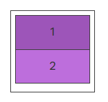
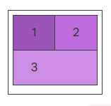
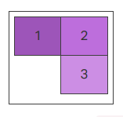

# Resources

**Read or watch:**

- [A Complete Guide to Flexbox | CSS-Tricks](https://css-tricks.com/snippets/css/a-guide-to-flexbox/)
- [Flexbox Froggy - A game for learning CSS flexbox](https://flexboxfroggy.com/)
- [Flexbox Defense](http://www.flexboxdefense.com/)
- [Flexbox Cheatsheet](https://yoksel.github.io/flex-cheatsheet/)
- [CSS Flexible Box Layout - CSS: Cascading Style Sheets | MDN](https://developer.mozilla.org/en-US/docs/Web/CSS/CSS_flexible_box_layout)
- [afonsopacifer/awesome-flexbox: A curated list of CSS Flexible Box Layout Module or only Flexbox.](https://github.com/afonsopacifer/awesome-flexbox)
- [Build with Flexbox](https://flexbox.buildwithreact.com/)
- [Flexplorer](https://bennettfeely.com/flexplorer/)
- [CSS Flexible Box Layout Module Level 1](https://www.w3.org/TR/css-flexbox-1/#flex)
- [FLEX: A simple visual cheatsheet for flexbox](https://flexbox.malven.co/)

# Learning Objectives
At the end of this project, you are expected to be able to [explain to anyone](https://fs.blog/feynman-learning-technique/), **without the help of Google:**

- What is Flexbox?
- How to convert float positioning to a flex display
- How to horizontally and vertically align elements using Flexbox
- The difference between the main and cross axes
- Properties that work on flex elements vs flex container
- Shorthands for flex
- How to create a new page with flex in mind

# Requirements
- Allowed editors: `vi`, `vim`, `emacs`
- A `README.md` at the root of the project directory is mandatory
- All of your code will be executed on Ubuntu 18.04 using Python 3.7.x
- All of your files should end with a new line

# Files

**Required images for your HTML files**

Download the images linked in the `CSS Advanced` project and place them into an images directory at the root of the project.

- [`HTML starter file`](index.html)

- [`CSS starter file`](index.css)

**Files for tasks 10 and onward**

- [`article.html`](article.html)

## Quiz questions

### Question #0

Which of these CSS attributes are part of the “Flex container”?

Select all correct answers

- [ ] align-items

- [ ] align-self

- [ ] order

- [ ] flex-wrap

- [ ] flex

- [ ] justify-content

### Question #1

What’s the “flex” equivalent of:

1	2

- [ ] flex-direction: column

- [ ] flex-direction: row

### Question #2

Which of these CSS attributes are part of the “Flex items”?

Select all correct answers

- [ ] order

- [ ] align-content

- [ ] align-self

- [ ] flex-direction

- [ ] flex-shrink

### Question #3

What’s the “flex” equivalent of:

- [ ] flex-direction: column

- [ ] flex-direction: row

### Question #4

What’s the “flex” equivalent of:

- [ ] Container: `flex-direction: row` + `flex-wrap: wrap` / last item: `flex-grow: 0`

- [ ] Container: `flex-direction: column` + `flex-wrap: wrap`

- [ ] Container: `flex-direction: row` / last item: `flex-grow: 1`

- [ ] Container: `flex-direction: row` + `flex-wrap: wrap` / last item: `flex-grow: 1`

### Question #5

What’s the “flex” equivalent of:

- [ ] Container: `flex-direction: row` + `flex-wrap: nowrap` + `justify-content: flex-end`

- [ ] Container: `flex-direction: row` + `flex-wrap: wrap` + `justify-content: flex-end`

- [ ] Container: `flex-direction: row` + `flex-wrap: wrap` + `justify-content: flex-start`

- [ ] Container: `flex-direction: column` + `flex-wrap: wrap` + `justify-content: flex-end`

### Question #6

What’s the “flex” equivalent of:

- [ ] Container: `flex-direction: column` + `justify-content: center`

- [ ] Container: `flex-direction: row` + `flex-wrap: nowrap`

- [ ] Container: `flex-direction: row` + `flex-wrap: wrap`

- [ ] Container: `flex-direction: row` / last item: `flex-grow: 2`
